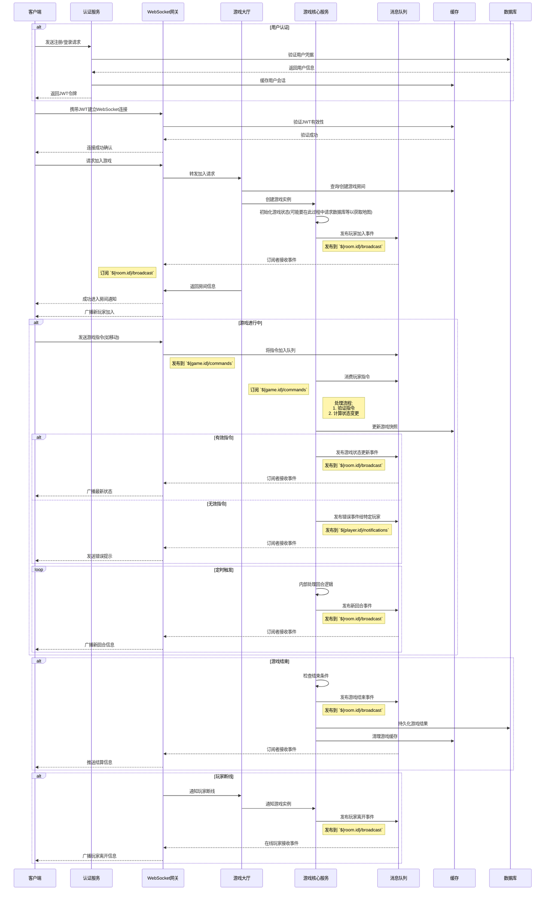

# Slareneg

## 开发计划

### 整体
仿照 [generals.io](https://generals.io/) 完成一个网页小游戏

- generals 核心玩法
   - 地图元素（空格，兵格，城堡，将军，山脉）
   - 可操作元素（兵的移动、占领，地图缩放和拖动等）
   - 回合机制
- 简单的控制界面（模式选择）

#### 前端
- 地图元素
- 可操作元素

#### 后端
尚未考虑：
- 地图的生成
- 地图市场
- 玩家排位机制（分数计算/排行榜规则）

##### 架构设计

后端游戏系统采用分层架构设计，主要分为两个核心层次：

1. **事件转发层 (Game)**
   - 负责事件的订阅、解析和转发
   - 消费来自消息队列的player/control事件
   - 调用GameCore的相应方法处理游戏逻辑
   - 将GameCore返回的事件发布到相应的topic (broadcast/player/control)
   - 处理游戏生命周期管理

2. **游戏逻辑层 (GameCore/BaseCore)**
   - 纯粹的游戏逻辑处理，无外部依赖
   - 提供标准化的事件返回接口
   - 处理玩家动作、回合机制、胜负判定等核心逻辑
   - 使用统一的事件类型系统 (core/event.go)

这种设计的优势：
- **职责分离**：事件处理与游戏逻辑完全分离
- **可测试性**：GameCore可以独立进行单元测试
- **可扩展性**：可以轻松替换事件系统或游戏逻辑
- **类型安全**：所有事件使用统一的类型定义

##### 大致数据流

