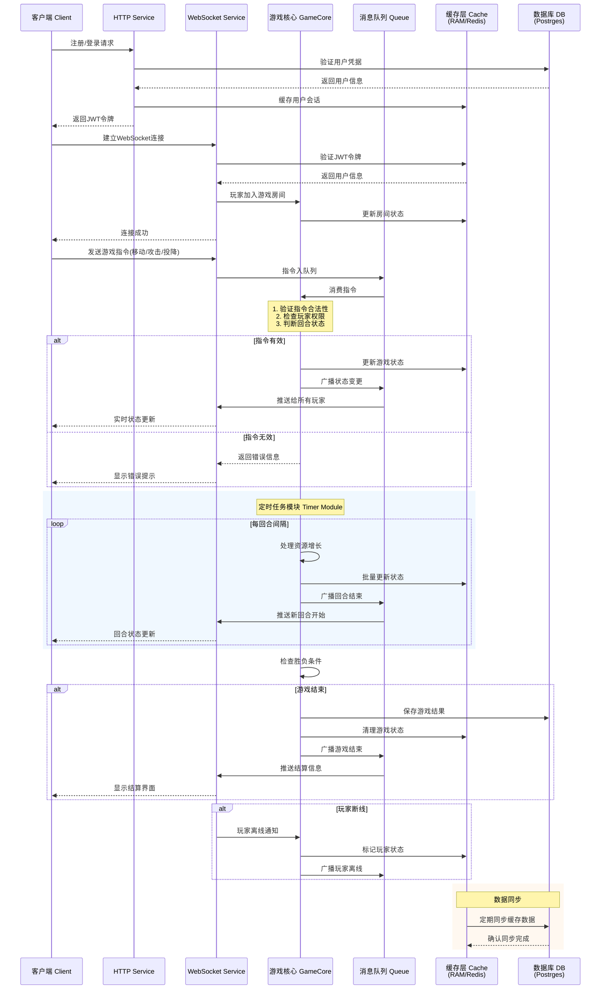

# Slareneg

## 开发计划

### 整体
仿照 [generals.io](https://generals.io/) 完成一个网页小游戏

- generals 核心玩法
   - 地图元素（空格，兵格，城堡，将军，山脉）
   - 可操作元素（兵的移动、占领，地图缩放和拖动等）
   - 回合机制
- 简单的控制界面（模式选择）

#### 前端
- 地图元素
- 可操作元素

#### 后端
尚未考虑：
- 地图的生成
- 地图市场
- 玩家排位机制（分数计算/排行榜规则）

##### 大致数据流

