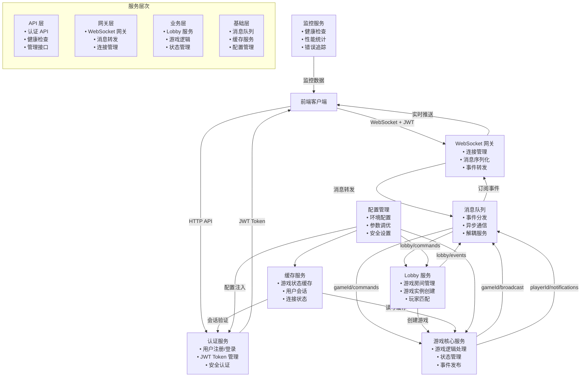

# Slareneg Game Server

## 概述

Slareneg 游戏服务器是一个采用微服务架构的实时在线游戏后端，支持多人对战、实时同步、用户认证等功能。

## 架构特点

- **分层架构**: API层、网关层、业务层、基础层清晰分离
- **事件驱动**: 基于消息队列的异步事件处理
- **微服务设计**: 各服务职责单一，松耦合
- **依赖注入**: 使用 Google Wire 实现依赖注入，易于测试和扩展
- **接口驱动**: 所有组件基于接口设计，支持多种实现
- **高性能**: 内存缓存、连接池、异步处理
- **安全认证**: JWT token 认证，密码加密存储
- **可配置**: 灵活的配置管理，支持环境变量覆盖

## 依赖注入架构

项目使用 [Google Wire](https://github.com/google/wire) 进行依赖注入，具有以下优势：

### 接口设计
所有核心组件都基于接口设计：
- `UserRepository`: 用户数据存储接口
- `TokenService`: JWT 令牌服务接口  
- `PasswordService`: 密码加密服务接口
- `Cache`: 缓存服务接口
- `Queue`: 消息队列接口

### 轻松切换实现
通过 Wire 可以轻松切换不同的实现：

```go
// 内存实现 (开发/测试)
auth.NewInMemoryUserRepository()

// 数据库实现 (生产环境)
auth.NewDatabaseUserRepository()
```

### 编译时依赖解析
Wire 在编译时生成依赖注入代码，无运行时反射开销：

```go
// 自动生成的代码
func InitializeApplication(cfg *config.Config) (*Application, error) {
    inMemoryUserRepository := auth.NewInMemoryUserRepository()
    jwtTokenService := provideJWTTokenService(cfg)
    authService := auth.NewAuthService(inMemoryUserRepository, jwtTokenService, ...)
    // ...
}
```

## 服务组件

### 1. 认证服务 (Auth Service)
- 用户注册和登录
- JWT token 生成和验证
- 密码安全存储 (Argon2 加密)
- 认证中间件

### 2. WebSocket 网关 (WebSocket Gateway)
- WebSocket 连接管理
- 消息序列化/反序列化
- 事件转发到消息队列
- 客户端状态管理

### 3. Lobby 服务 (Lobby Service)
- 游戏房间创建和管理
- 游戏实例生命周期管理
- 玩家匹配和分配
- 房间状态同步

### 4. 游戏核心服务 (Game Core Service)
- 游戏逻辑处理
- 游戏状态管理
- 回合机制和计时器
- 胜负判定

### 5. 缓存服务 (Cache Service)
- 游戏状态快照
- 用户会话缓存
- 连接状态管理
- 性能统计

### 6. 配置管理 (Config Management)
- 统一配置管理
- 环境变量支持
- 配置验证
- 运行时配置热更新

## 快速开始

### 1. 环境要求
- Go 1.21+
- Git

### 2. 编译和运行

```bash
# 克隆项目
git clone <repository-url>
cd slareneg/packages/server

# 安装依赖
go mod tidy

# 生成Wire代码 (可选，代码已提交)
go generate ./internal/wire

# 编译
go build -o server .

# 复制配置文件
cp config.example.json config.json

# 修改JWT密钥
# 编辑 config.json，将 jwtSecret 改为自定义值

# 运行服务器
./server
```

### 3. 使用不同实现

项目支持多种实现切换：

```bash
# 使用内存实现 (默认)
go build -o server .

# 使用数据库实现 (需要先实现具体的数据库逻辑)
go build -tags database -o server .
```

### 4. 配置文件

创建 `config.json` 配置文件（参考 `config.example.json`）：

```json
{
  "server": {
    "host": "0.0.0.0",
    "port": 8080,
    "staticDir": "./static"
  },
  "auth": {
    "jwtSecret": "your-secret-key-here",
    "tokenExpiry": "24h"
  },
  "game": {
    "maxRooms": 100,
    "maxPlayersPerRoom": 8
  }
}
```

### 5. 环境变量

可以通过环境变量覆盖配置：

```bash
export SERVER_PORT=9000
export JWT_SECRET=your-production-secret
export LOG_LEVEL=debug
./server
```

## 开发指南

### 添加新服务

1. 定义接口：
```go
type NewService interface {
    DoSomething() error
}
```

2. 创建实现：
```go
type NewServiceImpl struct{}

func NewNewService() *NewServiceImpl {
    return &NewServiceImpl{}
}

func (s *NewServiceImpl) DoSomething() error {
    return nil
}
```

3. 更新 Wire 配置：
```go
wire.Build(
    // 其他依赖...
    NewNewService,
    wire.Bind(new(NewService), new(*NewServiceImpl)),
)
```

4. 重新生成 Wire 代码：
```bash
go generate ./internal/wire
```

### 切换实现

只需在 Wire 配置中替换对应的构造函数：

```go
// 从
auth.NewInMemoryUserRepository,

// 改为
auth.NewDatabaseUserRepository,
```

## API 接口

### 认证接口

#### 用户注册
```http
POST /api/auth/register
Content-Type: application/json

{
  "username": "player1",
  "email": "player1@example.com", 
  "password": "password123"
}
```

#### 用户登录
```http
POST /api/auth/login
Content-Type: application/json

{
  "username": "player1",
  "password": "password123"
}
```

### 管理接口

#### 健康检查
```http
GET /health
```

#### 缓存统计（需要认证）
```http
GET /api/cache/stats
Authorization: Bearer <jwt-token>
```

### WebSocket 连接

```javascript
// 客户端连接示例
const token = '<jwt-token>';
const ws = new WebSocket('ws://localhost:8080/ws', [], {
  headers: {
    'Authorization': `Bearer ${token}`
  }
});

// 发送消息
ws.send(JSON.stringify({
  type: 'createGame',
  gameId: 'room-123',
  payload: {}
}));
```

## WebSocket 消息格式

### 客户端到服务器

```json
{
  "type": "join|leave|move|forceStart|surrender|createGame",
  "gameId": "room-id",
  "payload": {
    // 具体数据根据消息类型而定
  }
}
```

### 服务器到客户端

```json
{
  "type": "gameState|playerJoined|gameStarted|error",
  "data": {
    // 事件数据
  }
}
```

## 开发和调试

### 开发模式运行

```bash
# 设置开发模式
export LOG_LEVEL=debug
export LOG_DEVELOPMENT=true

# 运行
go run main.go
```

### 测试

```bash
# 运行所有测试
go test ./...

# 运行特定模块测试
go test ./internal/game/...

# 性能测试
go test -bench=. ./internal/game/...
```

### 日志级别

- `debug`: 详细的调试信息
- `info`: 一般信息（默认）
- `warn`: 警告信息
- `error`: 错误信息

## 部署

### Docker 部署

```dockerfile
FROM golang:1.21-alpine AS builder
WORKDIR /app
COPY . .
RUN go mod tidy && go build -o server .

FROM alpine:latest
RUN apk --no-cache add ca-certificates
WORKDIR /root/
COPY --from=builder /app/server .
COPY --from=builder /app/config.example.json ./config.json
COPY --from=builder /app/static ./static
CMD ["./server"]
```

### 环境变量配置

生产环境建议通过环境变量设置敏感配置：

```bash
export JWT_SECRET=very-secure-secret-key
export SERVER_HOST=0.0.0.0
export SERVER_PORT=8080
export LOG_LEVEL=info
export LOG_FORMAT=json
```

## 性能监控

服务器提供了以下监控端点：

- `/health` - 健康检查
- `/api/cache/stats` - 缓存统计
- 日志记录包含性能指标

## 故障排除

### 常见问题

1. **编译错误**: 确保 Go 版本 >= 1.21
2. **连接失败**: 检查防火墙和端口配置
3. **认证失败**: 验证 JWT secret 配置
4. **性能问题**: 调整缓存和连接池配置

### 日志分析

```bash
# 查看错误日志
./server 2>&1 | grep ERROR

# 查看WebSocket连接日志
./server 2>&1 | grep websocket
```

## 贡献指南

1. Fork 项目
2. 创建特性分支
3. 提交变更
4. 创建 Pull Request


